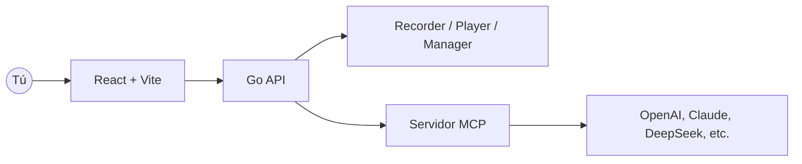

<p align="center">
  
</p>

<p align="center">
  <a href="./README.md">English</a> · <a href="./README.zh-CN.md">简体中文</a> · <a href="./README.ja.md">日本語</a> · Español · <a href="./README.pt.md">Português</a>
</p>

<p align="center"><a href="https://browserwing.com">browserwing.com</a></p>

## Destacados

- Gestión del navegador: iniciar, controlar y persistir sesiones con cookies
- Grabación de scripts: capturar clics, entradas y navegación; edición visual
- Integración MCP: convertir scripts a comandos del Model Context Protocol
- Soporte de LLM: configurar OpenAI, Claude, DeepSeek, etc., para extracción

## Requisitos

- Google Chrome o Chromium instalado y accesible en el entorno.

## Inicio Rápido

### Opción A — Descargar Release (recomendado)

- Descarga el binario precompilado para tu sistema desde [Releases](https://github.com/browserwing/browserwing/releases).
- Ejecuta la app y abre `http://localhost:8080`.

```bash
# Linux/macOS
chmod +x ./browserwing
./browserwing --port 8080

# Windows (PowerShell)
./browserwing.exe --port 8080
```

**⚠️ Usuarios de macOS:**  
Si encuentras un error "killed" al ejecutar, corrígelo con:
```bash
xattr -d com.apple.quarantine $(which browserwing)
```
Ver la [Guía de corrección de instalación en macOS](docs/MACOS_INSTALLATION_FIX.md) para más detalles.

### Opción B — Compilar desde código fuente

```bash
# Instalar dependencias (requiere Go y pnpm)
make install

# Compilar binario integrado (frontend embebido)
make build-embedded
./build/browserwing --port 8080

# O compilar todos los targets y empaquetar
make build-all
make package
```

## ¿Por qué BrowserWing?

- Ecosistema activo y scripts enriquecidos para completar tareas rápidamente
- Diseño eficiente en tokens y rendimiento rápido
- Automatiza tareas web complejas con scripts reproducibles y fiables
- Con MCP, conecta acciones grabadas con flujos de trabajo de LLM
- Sesiones estables mediante gestión de cookies y almacenamiento
- Ideal para extracción de datos, RPA, pruebas y navegación con agentes

## Arquitectura



## Guía de Uso

1. Gestiona navegadores: inicia instancias, perfiles y cookies
2. Graba scripts: guarda pasos para reproducir y editar
3. Convierte a MCP: expón scripts como herramientas/comandos MCP
4. Llama con LLMs: orquesta la automatización del navegador vía MCP

## Contribuir

- Se aceptan issues y PRs. Incluye pasos de reproducción o motivación clara.
- Para nuevas funciones, abre una discusión con casos de uso y resultados esperados.

## Comunidad

Discord: [https://discord.gg/BkqcApRj](https://discord.gg/BkqcApRj)
twitter: [https://x.com/chg80333](https://x.com/chg80333)

## Agradecimientos

- Inspirado por la automatización moderna del navegador, flujos de agentes y MCP.

## Licencia

- Licencia MIT. Consulta `LICENSE`.

## Aviso Legal

- No utilizar con fines ilegales ni para violar términos de sitios.
- Destinado solo para aprendizaje personal y automatización legítima.
