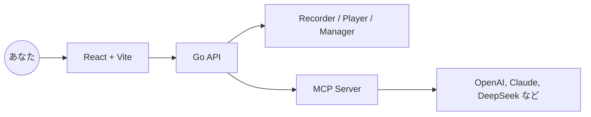

<p align="center">
  
</p>

<p align="center">
  <a href="./README.md">English</a> · <a href="./README.zh-CN.md">简体中文</a> · 日本語 · <a href="./README.es.md">Español</a> · <a href="./README.pt.md">Português</a>
</p>

<p align="center"><a href="https://browserwing.com">browserwing.com</a></p>

## 特長

- ブラウザ管理：起動・制御・セッション永続化（Cookie など）
- スクリプト録画：クリック、入力、ナビゲーションを記録し、可視的に編集
- MCP 連携：スクリプトを Model Context Protocol コマンドに変換
- LLM 対応：OpenAI、Claude、DeepSeek などによる抽出・自動化


## 必要要件

- Google Chrome または Chromium がインストールされ、実行可能であること。

## クイックスタート

### 方法 A — リリース版をダウンロード（推奨）

- [Releases](https://github.com/browserwing/browserwing/releases) から OS 向けのバイナリをダウンロードします。
- 実行後に `http://localhost:8080` を開きます。

```bash
# Linux/macOS
chmod +x ./browserwing
./browserwing --port 8080

# Windows (PowerShell)
./browserwing.exe --port 8080
```

### 方法 B — ソースからビルド

```bash
# 依存をインストール（Go と pnpm が必要）
make install

# 統合バイナリ（フロントエンドを埋め込み）
make build-embedded
./build/browserwing --port 8080

# すべてのターゲットをビルドしてパッケージ化
make build-all
make package
```

## なぜ BrowserWing なのか

- 活発なエコシステムと豊富なスクリプトで作業を迅速化
- トークン効率が良く、高速に動作
- 再生可能なスクリプトで複雑な Web 作業を自動化
- MCP により録画アクションを LLM ワークフローへ橋渡し
- セッションや設定を維持して安定した動作を実現
- データ抽出、RPA、テスト、エージェントブラウジングに最適

## アーキテクチャ



## 使い方

1. ブラウザ管理：インスタンス起動、プロファイル設定、Cookie 処理
2. スクリプト録画：手順を記録して再生・編集
3. MCP へ変換：スクリプトを MCP ツール/コマンドとして公開
4. LLM から呼び出し：MCP 経由でブラウザ自動化を編成

## コントリビューション

- Issue と PR を歓迎します。再現手順や動機を明確に記載してください。
- 機能提案はディスカッションで、ユースケースと期待結果を共有してください。

## コミュニティ

Discord: [https://discord.gg/BkqcApRj](https://discord.gg/BkqcApRj)
twitter: [https://x.com/chg80333](https://x.com/chg80333)

## 謝辞

- ブラウザ自動化、エージェントワークフロー、MCP にインスパイアされています。

## ライセンス

- MIT ライセンス。`LICENSE` を参照してください。

## 免責事項

- 違法目的やサイト規約違反に使用しないでください。
- 個人の学習および適法な自動化用途に限ります。
