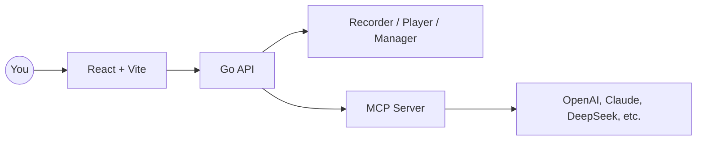

<p align="center">
  
</p>

<p align="center">
  
  
  
  
  
  
</p>

<p align="center">
  English · <a href="./README.zh-CN.md">简体中文</a> · <a href="./README.ja.md">日本語</a> · <a href="./README.es.md">Español</a> · <a href="./README.pt.md">Português</a>
</p>

<p align="center"><a href="https://browserwing.com">browserwing.com</a></p>


https://github.com/user-attachments/assets/7018126f-01c8-468f-a30d-3ca36f769876


## Highlights

- **🎯 Claude Skills Integration**: Install and use `SKILL.md` directly as a Claude Skill
- **📝 Script to Skill Export**: Convert your recorded scripts to `SKILL.md` format for Claude
- **🚀 Complete Executor API**: 26 HTTP endpoints for browser automation with full Claude Skills support
- Browser management: launch, control, and persist sessions with cookies
- Script recording: capture clicks, inputs, navigations, and edit visually
- MCP integration: convert scripts to Model Context Protocol commands
- LLM support: configure OpenAI, Claude, DeepSeek and more for extraction

## Requirements

- Google Chrome or Chromium installed and accessible in your environment.

## Quick Start

### Option A — Download Release (recommended)

- Download the prebuilt binary for your OS from [Releases](https://github.com/browserwing/browserwing/releases).
- Run the app and open `http://localhost:8080`.

```bash
# Linux/macOS
chmod +x ./browserwing
./browserwing --port 8080

# Windows (PowerShell)
./browserwing.exe --port 8080
```

### Option B — Build from Source

```bash
# Install deps (Go + pnpm required)
make install

# Build integrated binary (frontend embedded)
make build-embedded
./build/browserwing --port 8080

# Or build all targets and packages
make build-all
make package
```

## 🎯 Claude Skills Integration (New!)

**Use BrowserWing directly with Claude:**

1. Start BrowserWing (see above)
2. Import [SKILL.md](https://raw.githubusercontent.com/browserwing/browserwing/refs/heads/main/SKILL.md) into Claude Desktop:
   - Open Claude Desktop → Settings → Skills
   - Add Skill → Select `SKILL.md` from the repository root
   - Enable the skill
3. Start automating! Claude can now control your browser through natural language

**Example:**
```
You: "Search for 'AI tools' on example.com and extract the top 5 results"
Claude: [Uses BrowserWing API to navigate, interact, and extract data]
```

**Export your recorded scripts as Skills:**
```bash
# Export all scripts
curl -X POST 'http://localhost:8080/api/v1/scripts/export/skill' \
  -H 'Content-Type: application/json' \
  -d '{"script_ids": []}' \
  -o MY_SCRIPTS_SKILL.md

# Import into Claude and use your custom automation scripts!
```

## Why BrowserWing

- **🎯 Native Claude Skills Support**: Works out-of-the-box with Claude Desktop (like playwright-mcp)
- **📝 Script Export to Skills**: Turn your recorded automation into reusable Claude Skills
- **🚀 26+ API Endpoints**: Complete HTTP API for programmatic browser control
- Active ecosystem and rich scripts help you finish tasks fast
- Token-efficient design with fast performance
- Automates complex web tasks with reliable, replayable scripts
- Bridges recorded actions with LLM workflows via MCP commands and Claude Skills
- Keeps sessions stable with cookie and storage management
- Designed for data extraction, RPA, testing, and agent-driven browsing

## Architecture



## Usage Guide

### For Claude Skills Users (Recommended)

1. **Install Skill**: Import `SKILL.md` into Claude Desktop
2. **Start automating**: Ask Claude to automate web tasks in natural language
3. **Export custom scripts**: Convert your recorded scripts to Skills for reusable automation

### For Advanced Users

1. Manage browsers: start instances, configure profiles, handle cookies
2. Record scripts: capture steps and save for replay/editing
3. Convert to MCP/Skills: expose scripts as MCP tools or Claude Skills
4. Call with LLMs: let models orchestrate browser automation via MCP or HTTP API

### API Endpoints

BrowserWing provides 26+ HTTP API endpoints for browser automation:
- Page navigation and control
- Element interaction (click, type, select)
- Data extraction and semantic analysis
- Screenshot and JavaScript execution
- Batch operations

**Full API Documentation**: See `docs/EXECUTOR_HTTP_API.md`

## Contributing

- Issues and PRs are welcome. Please include clear steps to reproduce or a concise rationale.
- For feature ideas, open a discussion with use cases and expected outcomes.

## Community

Discord: [https://discord.gg/BkqcApRj](https://discord.gg/BkqcApRj)
twitter: [https://x.com/chg80333](https://x.com/chg80333)

## Acknowledgements

- Inspired by modern browser automation, agentic workflows, and MCP.

## License

- MIT License. See `LICENSE`.

## Disclaimer

- Do not use for illegal purposes or to violate site terms.
- Intended for personal learning and legitimate automation only.
