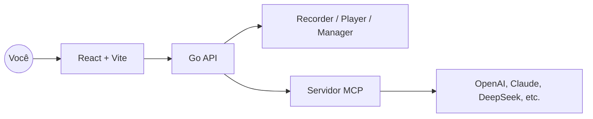

<p align="center">
  
</p>

<p align="center">
  <a href="./README.md">English</a> · <a href="./README.zh-CN.md">简体中文</a> · <a href="./README.ja.md">日本語</a> · <a href="./README.es.md">Español</a> · Português
</p>

<p align="center"><a href="https://browserwing.com">browserwing.com</a></p>

## Destaques

- Gestão de navegador: iniciar, controlar e persistir sessões com cookies
- Gravação de scripts: capturar cliques, entradas e navegação; edição visual
- Integração MCP: converter scripts em comandos do Model Context Protocol
- Suporte a LLM: configurar OpenAI, Claude, DeepSeek e outros para extração

## Requisitos

- Google Chrome ou Chromium instalado e acessível no ambiente.

## Início Rápido

### Opção A — Baixar Release (recomendado)

- Baixe o binário pré-compilado para seu sistema em [Releases](https://github.com/browserwing/browserwing/releases).
- Execute o app e abra `http://localhost:8080`.

```bash
# Linux/macOS
chmod +x ./browserwing
./browserwing --port 8080

# Windows (PowerShell)
./browserwing.exe --port 8080
```

**⚠️ Usuários de macOS:**  
Se você encontrar um erro "killed" ao executar, corrija com:
```bash
xattr -d com.apple.quarantine $(which browserwing)
```
Veja o [Guia de correção de instalação no macOS](docs/MACOS_INSTALLATION_FIX.md) para mais detalhes.

### Opção B — Compilar a partir do código

```bash
# Instalar dependências (Go e pnpm necessários)
make install

# Compilar binário integrado (frontend embutido)
make build-embedded
./build/browserwing --port 8080

# Ou compilar todos os targets e empacotar
make build-all
make package
```

## Por que BrowserWing

- Ecossistema ativo e scripts ricos para concluir tarefas rapidamente
- Design eficiente em tokens e desempenho rápido
- Automatiza tarefas web complexas com scripts reproduzíveis e confiáveis
- Com MCP, conecta ações gravadas a fluxos de trabalho de LLM
- Sessões estáveis com gerenciamento de cookies e armazenamento
- Ideal para extração de dados, RPA, testes e navegação com agentes

## Arquitetura



## Guia de Uso

1. Gerencie navegadores: instâncias, perfis e cookies
2. Grave scripts: salve passos para reprodução/edição
3. Converta para MCP: exponha scripts como ferramentas/comandos MCP
4. Chame com LLMs: orquestre automação do navegador via MCP

## Contribuindo

- Issues e PRs são bem-vindos. Inclua passos de reprodução ou motivação clara.
- Para novas funcionalidades, abra uma discussão com casos de uso e resultados esperados.

## Comunidade

Discord: [https://discord.gg/BkqcApRj](https://discord.gg/BkqcApRj)
twitter: [https://x.com/chg80333](https://x.com/chg80333)

## Agradecimentos

- Inspirado por automação de navegador moderna, fluxos agentic e MCP.

## Licença

- Licença MIT. Veja `LICENSE`.

## Aviso

- Não use para fins ilegais ou violar termos de sites.
- Destinado apenas ao aprendizado pessoal e automação legítima.
