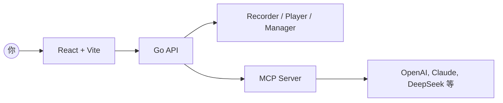

<p align="center">
  
</p>

<p align="center">
  <a href="./README.md">English</a> · 简体中文 · <a href="./README.ja.md">日本語</a> · <a href="./README.es.md">Español</a> · <a href="./README.pt.md">Português</a>
</p>

<p align="center"><a href="https://browserwing.com">browserwing.com</a></p>

## ✨ 特性亮点

- **🎯 Claude Skills 原生集成**：安装后直接使用 `SKILL.md` 作为 Claude 技能（类似 playwright-mcp）
- **📝 脚本导出为 Skill**：将录制的脚本一键转换为 `SKILL.md` 格式供 Claude 使用
- **🚀 完整 Executor API**：26 个 HTTP 端点，全面支持浏览器自动化与 Claude Skills
- 浏览器管理：启动、控制与会话持久化（Cookie 等）
- 脚本录制：点击、输入、导航等步骤捕获，并可视化编辑
- MCP 集成：将脚本转换为 Model Context Protocol 命令
- 大模型支持：配置 OpenAI、Claude、DeepSeek 等进行数据抽取

## ✅ 环境要求

- 环境中需安装 Google Chrome 或 Chromium，并可正常访问。

## 🚀 快速开始

### 方式 A — 下载 Release（二进制，推荐）

- 前往 [Releases](https://github.com/browserwing/browserwing/releases) 下载对应操作系统的预构建二进制。
- 运行后打开 `http://localhost:8080`。

如果你下载遇到问题，可以访问gitee下载：[gitee releases](https://gitee.com/browserwing/browserwing/releases)

```bash
# Linux/macOS
chmod +x ./browserwing
./browserwing --port 8080

# Windows (PowerShell)
./browserwing.exe --port 8080
```

### 方式 B — 源码构建

```bash
# 安装依赖（需要 Go 与 pnpm）
make install

# 构建集成版本（前端嵌入后端）
make build-embedded
./build/browserwing --port 8080

# 或构建全部目标并打包
make build-all
make package
```

## 🎯 Claude Skills 集成（新功能！）

**直接在 Claude 中使用 BrowserWing：**

1. 启动 BrowserWing（见上方）
2. 将 [SKILL.md](https://raw.githubusercontent.com/browserwing/browserwing/refs/heads/main/SKILL.md) 导入 Claude Desktop：
   - 打开 Claude Desktop → 设置 → Skills
   - 添加 Skill → 选择仓库根目录的 `SKILL.md`
   - 启用该技能
3. 开始自动化！Claude 现在可以通过自然语言控制你的浏览器

**示例对话：**
```
你: "帮我在淘宝搜索 'MacBook' 并提取前 5 个商品的价格"
Claude: [使用 BrowserWing API 自动导航、交互和提取数据]
```

**将录制的脚本导出为 Skills：**
```bash
# 导出所有脚本
curl -X POST 'http://localhost:8080/api/v1/scripts/export/skill' \
  -H 'Content-Type: application/json' \
  -d '{"script_ids": []}' \
  -o MY_SCRIPTS_SKILL.md

# 导入 Claude 后即可使用你的自定义自动化脚本！
```

## 🤖 为什么选择 BrowserWing

- **🎯 原生 Claude Skills 支持**：开箱即用，与 Claude Desktop 无缝集成
- **📝 脚本导出为 Skills**：将录制的自动化流程转换为可复用的 Claude 技能
- **🚀 26+ API 端点**：完整的 HTTP API，支持编程式浏览器控制
- 活跃生态与丰富脚本，助你快速完成任务
- Token 友好、速度较快
- 以可回放脚本自动化复杂网页任务，稳定、可靠
- 通过 MCP 和 Claude Skills 将录制动作桥接到 LLM 工作流
- 会话持久化与配置管理，避免频繁登录与失效
- 适用于数据抽取、RPA、测试与智能体驱动的浏览

## 🏗️ 架构



## 📖 使用步骤

### Claude Skills 用户（推荐）

1. **安装技能**：将 `SKILL.md` 导入 Claude Desktop
2. **开始自动化**：用自然语言让 Claude 执行网页任务
3. **导出自定义脚本**：将录制的脚本转换为 Skills 供重复使用

### 高级用户

1. 管理浏览器：启动实例、配置档案、处理 Cookie
2. 录制脚本：捕获步骤并保存用于回放/编辑
3. 转为 MCP/Skills：将脚本暴露为 MCP 工具或 Claude 技能
4. LLM 调用：通过 MCP 或 HTTP API 让模型编排浏览器自动化

### API 端点

BrowserWing 提供 26+ 个 HTTP API 端点用于浏览器自动化：
- 页面导航和控制
- 元素交互（点击、输入、选择）
- 数据提取和语义分析
- 截图和 JavaScript 执行
- 批量操作

**完整 API 文档**：查看 `docs/EXECUTOR_HTTP_API.md`

## 🤝 参与贡献

- 欢迎提交 Issue 和 PR，请附上复现步骤或清晰的动机。
- 新特性建议请在讨论区提出，描述使用场景与预期结果。

## 社区

- Discord: [https://discord.gg/BkqcApRj](https://discord.gg/BkqcApRj)
- twitter: [https://x.com/chg80333](https://x.com/chg80333)
- QQ群：点击链接加入群聊[【Browserwing用户群】](https://qun.qq.com/universal-share/share?ac=1&authKey=Wk%2FnSWvWLNO8Cegxo1PFqUmF%2Bntymd9JFl1l1n0GCwpWjeR2Yo7K91PgnugnK8N9&busi_data=eyJncm91cENvZGUiOiIxMDc4MTQwMTU1IiwidG9rZW4iOiJPa1pLeTVqai9EV09DRUpFeHM3dWVwclU5NW5LRDNRaEJ0ZTVld2lMbmFOelgxZWhia2JpZHhsc2hYbmxWdW1RIiwidWluIjoiMzE3NTQyNTQ4MCJ9&data=HbgiLCOhCT4c68pCpyI0whItk4SppgqtsjnQMaiP_zUtfM1O62y6jUFBVH0moLnQ_1ucw9gilYKMuMNux9F-FQ&svctype=4&tempid=h5_group_info)
- 加微信进交流群：mongorz（备注 browserwing）

可以直接扫码加微信群：


## 致谢

- 灵感源自现代浏览器自动化、智能体工作流与 MCP。

## 📄 许可证

- 采用 MIT 许可证，详见 `LICENSE`。

## ⚠️ 免责声明

- 请勿用于任何非法用途或违反网站条款的行为。
- 仅供个人学习与合规自动化使用。
